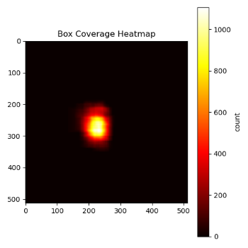

# AI CUP 2025秋季賽－電腦斷層心臟肌肉影像分割競賽 II－主動脈瓣物件偵測
### 本專案參與 2025 AICUP 電腦斷層主動脈瓣物件偵測競賽，最終採用 ROI-based YOLO + K-fold Ensemble + Post Processing 取得最佳成績。

### 隊伍名稱：TEAM_9890
---

## 模型訓練+推論Pipeline 圖
- 以下pipeline圖之檔案名稱僅供參考，與實際檔案名稱不相符
.png>)

---
## 競賽策略簡介

### 1. ROI (region of interest) CROP
- 透過統計所有的training bounding boxes 之位置與大小並視覺化為熱力圖 :


- 可以發現 Bounding Box 全集中在差不多的位置

- 依此特性，假定test data也遵循此分布，可以經由裁剪圖片除去背景，讓模型專注於辨識瓣膜

### 2. Ensemble
- 訓練資料僅有50位病患，且測試資料眾多，單一資料切分會造成overfitting

- 在單模型之下對training data切為 5 fold 進行 5次training (cross validation)

- 分別選出5次實驗最具潛力之model (挑選依據:高recall 高mAP50) 做 ensemble

### 3. 後處理
- 經程式檢查，所有的training label 皆在同序列中，無多重序列或離散的 Bounding Box

- 透過程式偵測推論txt中每位病患Bounding Box最長序列，不在其中的可以無條件剔除

- 舉例 對patient0010的推論結果為 0052 0053 0072 0081 0082 0083... 0100 0101 0150 0151 有畫框，則後處理偵測到最長序列長度為 0081到0101 長度為20， 0052 0053 0072 0150 0151 皆視為噪聲無條件刪除
---
## 檔案結構與檔案說明
- `train.ipynb` :
    - 負責ROI前處理

    - KFOLD資料切分與建立
    - YOLOv12s的模型參數設定與訓練

- `inference.py` : 
    - 執行testing data的推論

    - 需手動更改使用的模型以及輸出檔名路徑，分別執行五次推論以得5fold的推論結果

- `ensemble.py` :
    - 負責將推論的五份txt ensemble為單一txt檔案

- `del_seq.py` :
    - 後處理程式，透過Training GT的序列特性，清除不在最長序列內的噪聲

- `kfold_result` :
    - 資料夾內提供已推論完畢的五個txt檔案以及其ensemble的結果 (可用於執行ensemble.py 以及 del_seq.py)

- `requirement.txt` : 環境安裝清單
---

## 資料準備
- 需將競賽提供的三份資料解壓縮至專案根目錄
    - 42_training_image 
    - 42_testing_image 
    - 42_training_label

- 示意圖:
```text
AICUP2025/
├── 42_training_image
├── 42_testing_image 
├── 42_training_label
│
├── kfold_result/       
│   ├── ensemble_roi_1.txt
│   └── ...
├── inference.py          
├── ensemble.py          
├── del_seq.py            
├── yolo12s.pt            
├── requirement.txt       
└── README.md
```
---
## 執行流程
### 1. 訓練YOLO模型
- 執行 `train.ipynb`

- 5fold 資料集會自動切分並建立，5次訓練也會一併執行

- Output : 訓練結果儲存於 `runs/detect_kfold_roi`，當中會有五份資料夾 命名對應相應的fold 如 `runs/detect_kfold_roi/fold1_roi`

### 2. 執行推論
- 執行`inference.py`

- 需手動更改使用的模型 (eg. `runs/detect_kfold_roi/fold1_roi/weights/best.pt`) 以及輸出檔名(eg. `ensemble_roi_1.txt`)路徑，分別執行五次推論以得5fold的推論結果

- 按照本隊最佳結果之當次實驗，為了發揮ensemble method的優勢與潛力，權重挑選的基準為人工觀察result.csv的結果，選出在mAP50有一定水準之下，recall最高的那個epoch。

- Output : 每執行一次輸出一份推論txt檔 

### 3. Ensemble 5 fold results
- 備妥 5份 推論的 txt檔案 (不想重新推論可於 `kfold_result` 資料夾取用)

- 執行 `ensemble.py`
- Output : 一份ensemble過後的推論txt檔案

### 4. 後處理清除噪聲
- 備妥3. 產生的最終ensemble檔案 (`kfold_result`中有提供)

- 執行 `del_seq,py`

- Output: 三份檔案
    - `final_output.txt` : 用於繳交至系統之最終推論txt檔

    - `removed_output.txt` :用於分析清噪效果，txt存放因為不符序列規定清除掉的Bounding Box，純分析用，與繳交檔案無關

    - `removed_sorted_by_conf.txt` :結果和`removed_output.txt`相同，但依照confidence排序，純分析用，與繳交檔案無關
---
## 生成式 AI 工具使用聲明
- 使用工具：ChatGPT (OpenAI) / Gemini 3 pro

- 使用範圍：輔助 Python 程式碼生成與語法除錯，少部分策略探討，優化、及報告書潤飾，規範檢查

--- 
## 引用與致謝
- Ultralytics YOLO   [ultralytics/ultralytics: Ultralytics YOLO ](https://github.com/ultralytics/ultralytics)
- YOLO v12   [sunsmarterjie/yolov12: \[NeurIPS 2025\] YOLOv12: Attention-Centric Real-Time Object Detectors](https://github.com/sunsmarterjie/yolov12)

